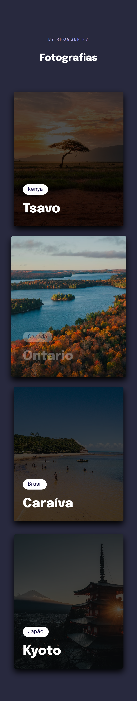
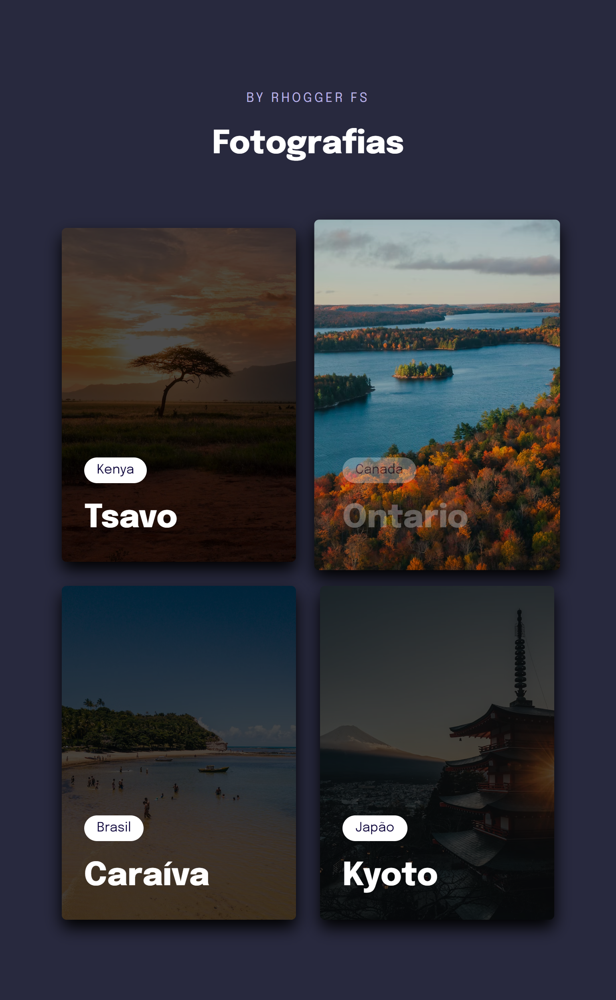

<h1 align="center">
Grid Training
</h1>

## Indexes

- [About](#about)
- [Built in](#built_in)
- [Go to](#go_to)
- [Preview](#preview)
- [TODO List](#todo_list)

 

## About 

This project was made in the 3nd module of Explorer level 3 - Rocketseat.

In this project, the grid is practiced in css, media queries, animations, transitions, responsiveness, filters, css variables, new pseudoclasses, clamp() and the scrollbar.

 

## Built in 

- HTML
- CSS

 

## Go to 

To access the site is simple, just click on the <a href = "https://grid-training.vercel.app">link</a>

 

## Preview 

   

### PC

  
  

### Mobile

  
  

### Tablet

  

## TODO List 

- [ ] Create buttons for different types of layouts. For example: portrait, landscape, grid, expandable, etc.
- [ ] Create landscape layout, leave the photos in landscape mode.
- [ ] Create portrait layout, leave the photos in portrait mode.
- [X] Create grid layout, let photos on display: grid with columns in 2fr and 1fr.
- [ ] Create the expandable layout, the user can click on the image and it will expand to 3fr, the rest will be 1fr.